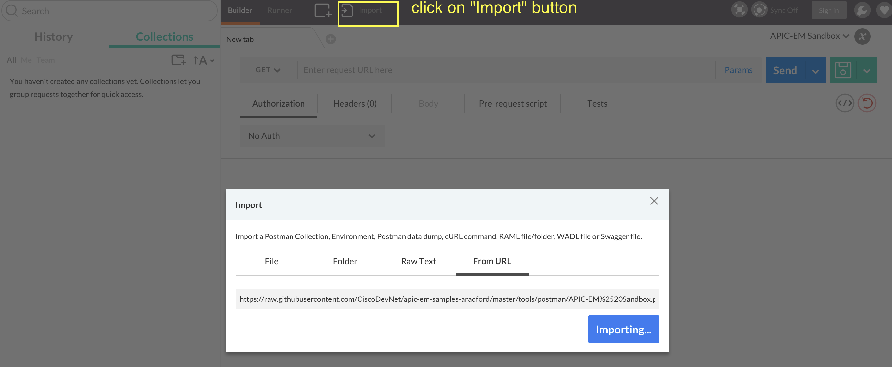
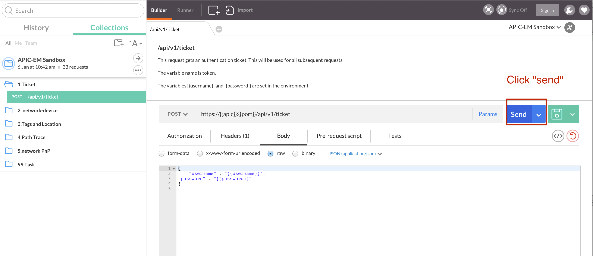

#Introduction
To use these examples, you need the latest version of postman (3.2.0).
It has free Jetpacks support.  This is required for linking requests.

#Importing
You need to import the collection as well as the environment.  You can import the raw git files using the **From URL** option, as seen below.
You can also download them and import from file/folder.

* https://raw.githubusercontent.com/CiscoDevNet/apic-em-samples-aradford/master/tools/postman/APIC-EM%2520Sandbox.postman_environment
* https://raw.githubusercontent.com/CiscoDevNet/apic-em-samples-aradford/master/tools/postman/APIC-EM%2520Sandbox.postman_collection

#Getting Started
Once you have done this, you need to first run the request to get a Ticket.  This request is in the **1.Ticket folder**.
The authentication token will then be used in subsequent requests.  It is stored in an environment variable.

**NOTE: If this request fails you may need to accept the certificate from the controller in your browser**
http://blog.getpostman.com/2014/01/28/using-self-signed-certificates-with-postman/

Inside each folder, the requests are sequential.  GET/POST/DELETE etc.  So you can run through them one by one.
You can also check on the UI for the controller to see the effect of the requests.

Most of the calls on the controller are asynchronous (PUT/POST/DELETE).  When you execute these calls, they will always
succeed and return a taskId.  The GET in **99.Task** folder will show you the result of the task.
Some tasks, when successful, will return an ID of the resource that was created.  This is in the "progress" field.
Where this is required for later use, I capture this in an environment variable.
If you click on the Environment variables quickview, you can see the variables that have been created.
For example, projectId will be used to delete a project later on, as well as to add devices to a PNP project.

#Next Steps
You can create your own environment, or modify the existing one to point to your own server.
**Note: the port 9443, will probably need to be changed as well as the server ip-address/name**
